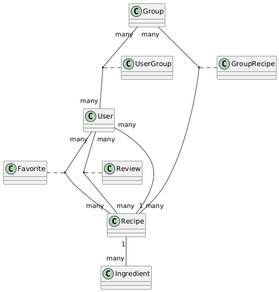

# Receitar-io

Receitar-io is an application for sharing and reviewing recipes within groups. Users can manage recipes,
organize favorites and add reviews.

## Features

- Manage recipes
- Organize recipes into favorite lists
- Join and share in groups
- Review and rate recipes

## Technologies

- **Java 21** and **Spring Boot 3**
- **Gradle** as the build tool
- **H2 Database** for persistence
- **Swagger** for API documentation
- **Rest Assured** for integration testing

## Getting Started

### Running the Application

1. Clone the repository
2. Navigate to the project directory
3. Run the application:
   ```sh
   ./gradlew bootRun 
   ```
4. The application will start on port 8081

### API Documentation

Swagger UI is available at:
http://localhost:8081/swagger-ui/index.html

### Testing

Integration tests are implemented using Rest Assured. To run tests, execute:

 ```sh
   ./gradlew test 
   ```

### Class diagram

